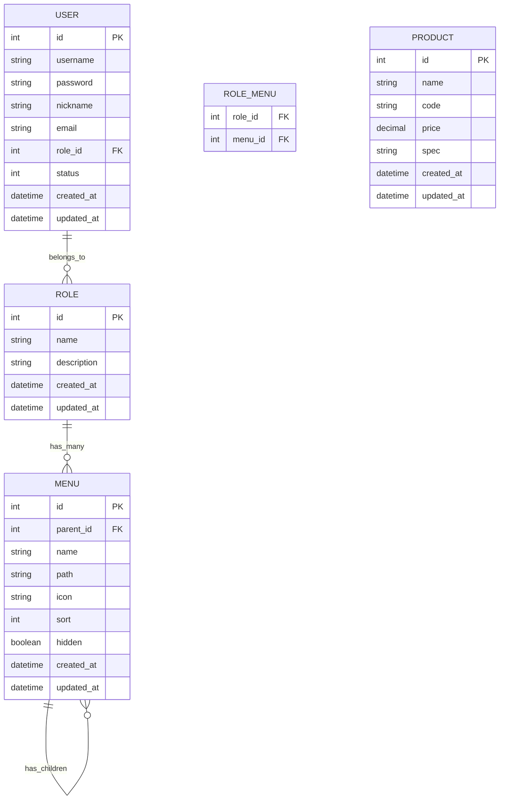

## 1. Architecture Design
```mermaid
graph TB
    subgraph Frontend
        A[Vue3 + Element Plus]
        B[Router]
        C[Axios]
        D[Pinia Store]
    end
    
    subgraph Backend
        E[Gin Framework]
        F[Middleware]
        G[Controllers]
        H[Services]
    end
    
    subgraph Data
        I[SQLite]
        J[GORM ORM]
    end
    
    A --&gt; B
    A --&gt; C
    A --&gt; D
    C --&gt; E
    E --&gt; F
    F --&gt; G
    G --&gt; H
    H --&gt; J
    J --&gt; I
```

## 2. Technology Description
- 前端: Vue@3 + Element Plus + Vue Router + Pinia + Axios + Vite
- 前端构建工具: Vite
- 后端: Go + Gin + GORM
- 数据库: SQLite
- 认证: JWT (JSON Web Token)
- 密码加密: bcrypt

## 3. Route Definitions
### Frontend Routes
| Route | Purpose |
|-------|---------|
| /login | 登录页面 |
| / | 首页（重定向到/dashboard） |
| /dashboard | 仪表盘 |
| /system/user | 用户管理 |
| /system/role | 用户组/角色管理 |
| /system/menu | 菜单管理 |
| /product | 产品管理 |

### Backend API Routes
| Method | Route | Purpose |
|--------|-------|---------|
| POST | /api/auth/login | 用户登录 |
| POST | /api/auth/register | 用户注册 |
| GET | /api/auth/me | 获取当前用户信息 |
| GET | /api/users | 获取用户列表 |
| POST | /api/users | 创建用户 |
| PUT | /api/users/:id | 更新用户 |
| DELETE | /api/users/:id | 删除用户 |
| PUT | /api/users/:id/status | 更新用户状态 |
| GET | /api/roles | 获取用户组列表 |
| POST | /api/roles | 创建用户组 |
| PUT | /api/roles/:id | 更新用户组 |
| DELETE | /api/roles/:id | 删除用户组 |
| PUT | /api/roles/:id/menus | 分配菜单权限 |
| GET | /api/menus | 获取菜单列表（树形） |
| POST | /api/menus | 创建菜单 |
| PUT | /api/menus/:id | 更新菜单 |
| DELETE | /api/menus/:id | 删除菜单 |
| GET | /api/menus/user | 获取当前用户菜单 |
| GET | /api/products | 获取产品列表 |
| POST | /api/products | 创建产品 |
| PUT | /api/products/:id | 更新产品 |
| DELETE | /api/products/:id | 删除产品 |

## 4. API Definitions
### 通用响应格式
```typescript
interface ApiResponse&lt;T&gt; {
  code: number;
  message: string;
  data: T;
}
```

### 用户相关
```typescript
interface User {
  id: number;
  username: string;
  nickname: string;
  email: string;
  roleId: number;
  status: number;
  createdAt: string;
  updatedAt: string;
}

interface LoginRequest {
  username: string;
  password: string;
}

interface LoginResponse {
  token: string;
  user: User;
  menus: Menu[];
}
```

### 用户组相关
```typescript
interface Role {
  id: number;
  name: string;
  description: string;
  menuIds: number[];
  createdAt: string;
  updatedAt: string;
}
```

### 菜单相关
```typescript
interface Menu {
  id: number;
  parentId: number;
  name: string;
  path: string;
  icon: string;
  sort: number;
  hidden: boolean;
  children?: Menu[];
  createdAt: string;
  updatedAt: string;
}
```

### 产品相关
```typescript
interface Product {
  id: number;
  name: string;
  code: string;
  price: number;
  spec: string;
  createdAt: string;
  updatedAt: string;
}

interface ProductListRequest {
  page: number;
  pageSize: number;
  name?: string;
}

interface ProductListResponse {
  list: Product[];
  total: number;
  page: number;
  pageSize: number;
}
```

## 5. Server Architecture Diagram
```mermaid
graph LR
    A[HTTP Request] --&gt; B[Gin Router]
    B --&gt; C[JWT Middleware]
    C --&gt; D[Controller]
    D --&gt; E[Service]
    E --&gt; F[GORM]
    F --&gt; G[(SQLite)]
```

## 6. Data Model
### 6.1 Data Model Definition


### 6.2 Data Definition Language
```sql
-- 用户表
CREATE TABLE users (
    id INTEGER PRIMARY KEY AUTOINCREMENT,
    username VARCHAR(50) NOT NULL UNIQUE,
    password VARCHAR(255) NOT NULL,
    nickname VARCHAR(50),
    email VARCHAR(100),
    role_id INTEGER,
    status INTEGER DEFAULT 1,
    created_at DATETIME DEFAULT CURRENT_TIMESTAMP,
    updated_at DATETIME DEFAULT CURRENT_TIMESTAMP
);

-- 用户组/角色表
CREATE TABLE roles (
    id INTEGER PRIMARY KEY AUTOINCREMENT,
    name VARCHAR(50) NOT NULL UNIQUE,
    description VARCHAR(255),
    created_at DATETIME DEFAULT CURRENT_TIMESTAMP,
    updated_at DATETIME DEFAULT CURRENT_TIMESTAMP
);

-- 菜单表
CREATE TABLE menus (
    id INTEGER PRIMARY KEY AUTOINCREMENT,
    parent_id INTEGER DEFAULT 0,
    name VARCHAR(50) NOT NULL,
    path VARCHAR(255),
    icon VARCHAR(50),
    sort INTEGER DEFAULT 0,
    hidden BOOLEAN DEFAULT FALSE,
    created_at DATETIME DEFAULT CURRENT_TIMESTAMP,
    updated_at DATETIME DEFAULT CURRENT_TIMESTAMP
);

-- 角色菜单关联表
CREATE TABLE role_menus (
    role_id INTEGER NOT NULL,
    menu_id INTEGER NOT NULL,
    PRIMARY KEY (role_id, menu_id)
);

-- 产品表
CREATE TABLE products (
    id INTEGER PRIMARY KEY AUTOINCREMENT,
    name VARCHAR(100) NOT NULL,
    code VARCHAR(50) NOT NULL UNIQUE,
    price DECIMAL(10, 2) DEFAULT 0,
    spec VARCHAR(255),
    created_at DATETIME DEFAULT CURRENT_TIMESTAMP,
    updated_at DATETIME DEFAULT CURRENT_TIMESTAMP
);

-- 初始化数据
-- 插入管理员角色
INSERT INTO roles (name, description) VALUES ('管理员', '系统管理员，拥有所有权限');

-- 插入管理员用户（密码: admin123）
INSERT INTO users (username, password, nickname, role_id, status) 
VALUES ('admin', '$2a$10$N9qo8uLOickgx2ZMRZoMyeIjZAgcfl7p92ldGxad68LJZdL17lhWy', '管理员', 1, 1);

-- 插入初始菜单
INSERT INTO menus (parent_id, name, path, icon, sort, hidden) VALUES
(0, '首页', '/dashboard', 'House', 1, 0),
(0, '系统设置', '', 'Setting', 2, 0),
(2, '用户管理', '/system/user', 'User', 1, 0),
(2, '角色管理', '/system/role', 'UserFilled', 2, 0),
(2, '菜单管理', '/system/menu', 'Menu', 3, 0),
(0, '产品管理', '/product', 'Goods', 3, 0);

-- 给管理员分配所有菜单
INSERT INTO role_menus (role_id, menu_id) VALUES
(1, 1), (1, 2), (1, 3), (1, 4), (1, 5), (1, 6);
```

