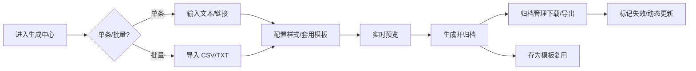

# QRForge 二维码工具 · 产品需求文档（PRD）

## 1. 产品概述

QRForge 是一款面向商业推广、物料制作与信息归档场景的一站式二维码批量生成与溯源管理工具。它解决传统二维码工具功能单一、无法批量运维的痛点，覆盖「生成—美化—解析—归档—溯源」全链路，帮助运营与设计人员高效产出可追溯的二维码资产。

- 主要用途：批量生成可美化二维码、批量解析识别、模板复用、生成记录归档与溯源管控
- 目标用户：商业推广运营、物料设计师、信息归档管理员
- 价值：批量产能 × 可视化美化 × 溯源管控，单机轻量化部署即可投产

## 2. 核心功能

### 2.1 用户角色

本项目为单机工具，无多角色权限划分，所有功能对本地使用者开放。

### 2.2 功能模块

1. **概览仪表盘**：产能统计、近期生成记录、失效预警、快捷入口
2. **生成中心**：单条 / 批量导入生成、可视化样式配置、实时预览、模板套用
3. **解析中心**：批量解析、图片识别解析、自动提取文本 / 链接
4. **模板库**：模板保存复用、样式预览、应用与编辑
5. **归档管理**：生成记录归档、批量下载打包导出、失效标记、内容动态更新

### 2.3 页面详情

| 页面名称 | 模块名称 | 功能描述 |
|-----------|-------------|---------------------|
| 概览仪表盘 | 产能统计卡 | 展示累计生成数、今日生成数、模板数、失效标记数等关键指标 |
| 概览仪表盘 | 近期记录 | 展示最近生成记录的缩略图、内容摘要、状态与时间 |
| 概览仪表盘 | 快捷入口 | 一键跳转生成、解析、模板、归档 |
| 生成中心 | 模式切换 | 单条生成 / 批量导入生成两种模式切换 |
| 生成中心 | 内容输入 | 单条：文本/链接输入；批量：文本框多行输入或文件导入（CSV/TXT） |
| 生成中心 | 样式配置 | 尺寸、前景色、背景色、边角样式（直角/圆角/圆点）、容错级别、内嵌 Logo、外边距 |
| 生成中心 | 实时预览 | 样式变更实时渲染二维码预览，支持放大检视 |
| 生成中心 | 模板套用 | 从模板库选择模板一键套用样式 |
| 生成中心 | 生成与保存 | 生成后归档至记录，可选保存为模板 |
| 解析中心 | 批量解析 | 文本框输入多条内容，批量解析并提取文本/链接 |
| 解析中心 | 图片识别 | 上传图片（支持多张/压缩包），识别解析二维码内容 |
| 解析中心 | 结果列表 | 展示解析结果、类型（文本/URL）、可复制、可一键反向归档生成 |
| 模板库 | 模板列表 | 卡片展示模板缩略图、名称、样式概要 |
| 模板库 | 模板操作 | 新建、编辑、删除、套用、预览 |
| 归档管理 | 记录列表 | 表格展示记录：缩略图、内容、类型、状态、创建时间 |
| 归档管理 | 筛选与搜索 | 按状态、时间、内容关键字筛选检索 |
| 归档管理 | 批量操作 | 批量下载、打包导出 ZIP、批量标记失效 |
| 归档管理 | 溯源管控 | 标记失效、内容修改后动态更新二维码并留痕 |

## 3. 核心流程

### 3.1 生成流程

用户进入生成中心 → 选择单条/批量模式 → 输入内容 → 配置样式（或套用模板）→ 实时预览校验 → 生成二维码 → 归档至记录（可选存为模板）→ 在归档管理中下载/导出。

### 3.2 解析流程

用户进入解析中心 → 选择文本批量解析或图片识别 → 提交内容/图片 → 后端解析并提取文本/链接 → 结果列表展示 → 可复制或反向归档生成。

### 3.3 溯源流程

在归档管理中检索记录 → 标记失效或修改内容 → 系统动态重新生成二维码并更新记录 → 失效状态在仪表盘预警。

## 4. 界面设计

### 4.1 设计风格

- **风格定位**：精密仪器 × 设计工具。深色「控制台」基调，让二维码与配色预览在深色背景上更突出；以二维码矩阵为视觉母题，贯穿网格、像素、扫描线等细节。
- **主色**：深炭黑底 `#0E0E11` / 面板 `#16161B` / 描边 `#26262E`
- **强调色**：电光青柠 `#D4FF3A`（主强调，用于关键操作与高亮），辅以冷琥珀 `#FFB454` 用于失效/警示态
- **按钮风格**：主按钮为实色青柠 + 深字；次按钮为描边幽灵按钮；圆角 8px，hover 微抬升与发光
- **字体**：标题用 Syne（几何、有个性）；技术数据/代码用 JetBrains Mono；正文用 IBM Plex Sans
- **布局**：左侧固定导航栏 + 顶部面包屑，主区域卡片网格布局；生成中心为三栏（输入｜配置｜预览）
- **图标**：线性细描边图标，配扫描线/像素点缀，呼应二维码主题

### 4.2 页面设计概览

| 页面名称 | 模块名称 | UI 元素 |
|-----------|-------------|-------------|
| 概览仪表盘 | 产能统计卡 | 网格卡片、大号数字、Mono 字体、青柠高亮指标 |
| 概览仪表盘 | 近期记录 | 横向滚动卡片、缩略图、状态徽标、扫描线入场动画 |
| 生成中心 | 样式配置 | 分组表单、颜色取色器、滑块、实时联动预览 |
| 生成中心 | 实时预览 | 居中棋盘格背景、二维码悬浮发光、放大检视 |
| 解析中心 | 图片识别 | 拖拽上传区、缩略图网格、解析进度条 |
| 模板库 | 模板列表 | 卡片网格、悬浮放大预览、操作浮层 |
| 归档管理 | 记录表格 | 紧凑表格、行内状态徽标、批量工具栏 |

### 4.3 响应式

桌面优先（≥1280px 三栏，1024–1280px 两栏，<1024px 单栏自适应）；移动端简化为单栏堆叠，保留核心生成与归档能力，触控目标 ≥44px。

### 4.4 动效

- 页面加载：交错淡入 + 轻微上移（staggered reveal）
- 二维码生成：扫描线从上至下扫过的高亮动画
- 预览切换：色彩/尺寸变更过渡 120ms ease
- 悬浮：卡片微抬升 + 青柠描边发光
