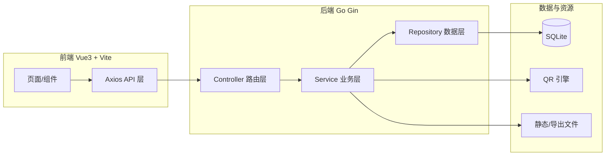
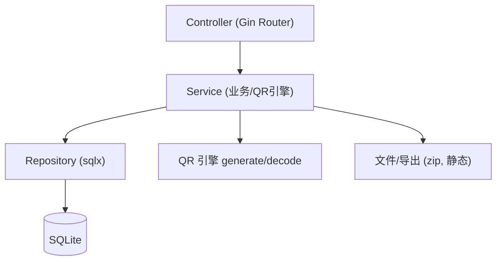
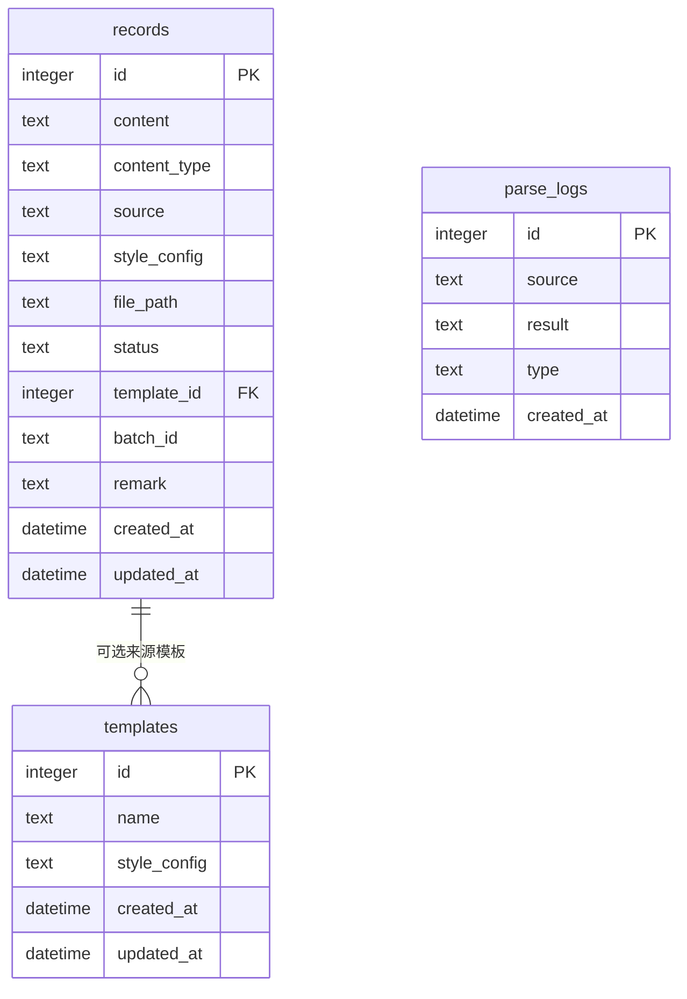

# QRForge 二维码工具 · 技术架构文档

## 1. 架构设计

单体轻量化架构：Vue3 前端（Vite 构建）+ Go Gin 后端 API + SQLite 嵌入式存储。后端编译为单一可执行文件，内嵌前端静态资源，实现「编译即部署」。



## 2. 技术说明

- **前端**：Vue@3 + Vite@5 + TailwindCSS@3 + Pinia + Vue Router@4 + Axios
  - 初始化工具：`npm create vite@latest`
  - 用户明确要求 Vue3，故采用 Vue 而非 React
- **后端**：Go 1.21+ + Gin + sqlx
- **数据库**：SQLite（纯 Go 驱动 `modernc.org/sqlite`，无需 CGO，便于交叉编译与轻量化部署）
- **二维码生成**：`github.com/yeqown/go-qrcode`（支持前景/背景色、圆角/圆点、内嵌 Logo、容错级别）
- **二维码解析**：`github.com/makiuchi-d/gozxing`（ZXing 的 Go 移植，支持图片识别）
- **打包导出**：标准库 `archive/zip`
- **部署方式**：后端 `go build` 产出单可执行文件，内嵌前端 `dist` 静态资源，直接运行监听端口即可访问

## 3. 路由定义

| 路由 | 用途 |
|-------|---------|
| / | 概览仪表盘：产能统计、近期记录、快捷入口 |
| /generate | 生成中心：单条/批量生成、样式配置、实时预览 |
| /parse | 解析中心：批量解析、图片识别 |
| /templates | 模板库：模板保存、复用、编辑 |
| /archive | 归档管理：记录列表、批量导出、溯源管控 |

## 4. API 定义

所有接口前缀 `/api`，统一响应结构：

```go
type Response struct {
    Code    int         `json:"code"`    // 0 成功，非 0 失败
    Message string      `json:"message"`
    Data    interface{} `json:"data"`
}
```

样式配置结构（style_config JSON）：

```go
type StyleConfig struct {
    Size        int    `json:"size"`        // 像素尺寸，默认 256
    Foreground  string `json:"foreground"`  // 前景色 #RRGGBB
    Background  string `json:"background"`  // 背景色
    CornerStyle string `json:"cornerStyle"` // square | rounded | dot
    EccLevel    string `json:"eccLevel"`    // L | M | Q | H
    Margin      int    `json:"margin"`      // 外边距
    Logo        string `json:"logo"`        // base64 内嵌 Logo，可空
}
```

| 方法 | 路径 | 说明 | 请求 | 响应 |
|------|------|------|------|------|
| POST | /api/qrcode/generate | 单条生成 | `{content, styleConfig, saveTemplate?}` | `{id, filePath, previewUrl}` |
| POST | /api/qrcode/batch | 批量生成 | `{items:[{content,styleConfig?}], styleConfig}` | `{batchId, count, records:[]}` |
| POST | /api/parse/text | 批量文本解析 | `{texts:[...]}` | `{results:[{raw,type,content}]}` |
| POST | /api/parse/image | 图片识别解析 | multipart 多图/zip | `{results:[{fileName,type,content}]}` |
| GET | /api/templates | 模板列表 | query: `keyword` | `[{id,name,styleConfig,previewUrl}]` |
| POST | /api/templates | 新建模板 | `{name,styleConfig}` | `{id}` |
| PUT | /api/templates/:id | 更新模板 | `{name,styleConfig}` | `{ok}` |
| DELETE | /api/templates/:id | 删除模板 | — | `{ok}` |
| GET | /api/records | 记录列表 | query:`status,keyword,page,size` | `{total,list:[record]}` |
| GET | /api/records/:id | 记录详情 | — | `{record}` |
| PATCH | /api/records/:id/status | 标记失效/恢复 | `{status}` | `{ok}` |
| PUT | /api/records/:id/content | 动态更新内容 | `{content}` | `{filePath}` |
| DELETE | /api/records/:id | 删除记录 | — | `{ok}` |
| POST | /api/records/export | 打包导出 | `{ids:[...]}` | 二进制 ZIP 流 |
| GET | /api/stats | 仪表盘统计 | — | `{total,today,templates,invalid,recent:[]}` |

## 5. 服务端架构图

分层架构：Controller（路由与参数校验）→ Service（业务逻辑、QR 引擎调用）→ Repository（SQLite 持久化）。



## 6. 数据模型

### 6.1 数据模型定义



### 6.2 数据定义语言

```sql
CREATE TABLE IF NOT EXISTS templates (
    id           INTEGER PRIMARY KEY AUTOINCREMENT,
    name         TEXT    NOT NULL,
    style_config TEXT    NOT NULL,
    created_at   DATETIME DEFAULT CURRENT_TIMESTAMP,
    updated_at   DATETIME DEFAULT CURRENT_TIMESTAMP
);

CREATE TABLE IF NOT EXISTS records (
    id           INTEGER PRIMARY KEY AUTOINCREMENT,
    content      TEXT    NOT NULL,
    content_type TEXT    NOT NULL DEFAULT 'text',   -- text | url
    source       TEXT    NOT NULL DEFAULT 'single', -- single | batch | parse
    style_config TEXT    NOT NULL,
    file_path    TEXT    NOT NULL,
    status       TEXT    NOT NULL DEFAULT 'active', -- active | invalid
    template_id  INTEGER,
    batch_id     TEXT,
    remark       TEXT,
    created_at   DATETIME DEFAULT CURRENT_TIMESTAMP,
    updated_at   DATETIME DEFAULT CURRENT_TIMESTAMP,
    FOREIGN KEY (template_id) REFERENCES templates(id)
);

CREATE INDEX IF NOT EXISTS idx_records_status   ON records(status);
CREATE INDEX IF NOT EXISTS idx_records_batch    ON records(batch_id);
CREATE INDEX IF NOT EXISTS idx_records_created  ON records(created_at);

CREATE TABLE IF NOT EXISTS parse_logs (
    id         INTEGER PRIMARY KEY AUTOINCREMENT,
    source     TEXT,
    result     TEXT,
    type       TEXT,   -- text | url
    created_at DATETIME DEFAULT CURRENT_TIMESTAMP
);
```
